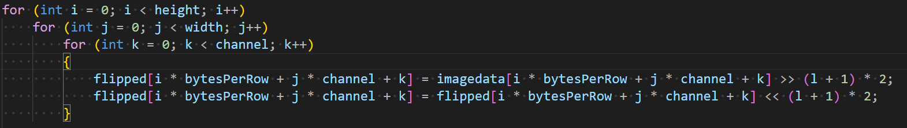
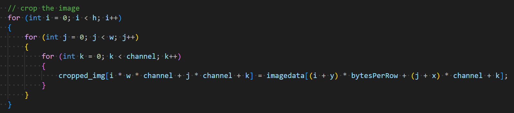

# <strong>
HW1 Image input/flip/output + Resolution + Cropping
</strong>
## 
DIP HW1

### 
Shun-Liang Yeh

### 
09/19/2024

### 

# I. Brief introduction of BMP format
- The BMP (Bitmap) format is a simple image file format primarily used on Windows. With file header, Dib header and color palette and pixel data, these headers stores the general information of a certain image. The data is in the format of RGB, with 1 byte representing a color pixel. 3 bytes an RGB group.

## Usual composition of bmp
- File Header: Basic file information like file size and the starting point of pixel data.
- DIB Header: Image properties such as width, height, color depth, and compression method.
- Color Palette (Optional): Defines colors if the image uses indexed color (for 8-bit or lower).
- Pixel Data: The actual image, stored pixel by pixel, usually uncompressed and often bottom-to-top.

- BMP is generally uncompressed, resulting in large file sizes, but supports various color depths.

# II. Resolution
- Reads the image in, extract the header information and the data pixels. Shift the unsigned bits according to the specified quantization bits to get the quantized image, stored it into a new container later write out the image.

## Resolution functions

- Main resolution function which shift the pixel data by specified quantized bit l then shift the bits back to get the corrected quantized data.

# III. Cropping

- Reads image in, extract information. Add user-interface to prevent the incorrect cropping. Then crop from the specified x,y coordinates.

## Function for image cropping

- Given the x,y,w,h it transfer the imageData into a new container cropped img to gets the new correctly cropped image.

